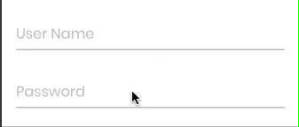

# FloatingTextField
This Swift Package supports floating label for Text Field and Secure Field in SwiftUI





# Installation
Install through Swift Package Manager.

# Usage

```
@State var username = ""
@State var password = ""


var body: some View {
  VStack {
    FloatingLabelTextField(placeHolder: "Input your name", text: $username, isSecure: false)
    FloatingLabelTextField(placeHolder: "Input your age", text: $password, , isSecure: true)
  }
}

```

